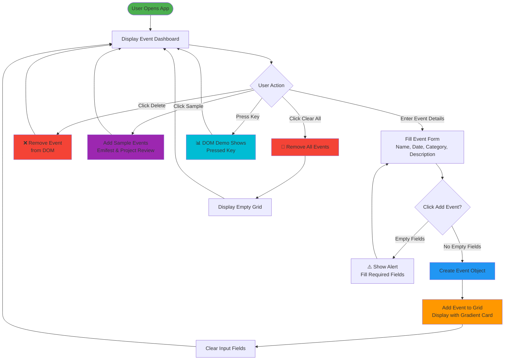

# Smart Event Dashboard 🎯

A dynamic event management web application that allows users to create, organize, and manage events with ease. Built with vanilla HTML, CSS, and JavaScript.

## Features

- ✅ **Add Events** - Create new events with name, date, category, and description
- 📋 **View Events** - Display all events in an organized grid layout
- 🗑️ **Delete Events** - Remove individual events with a single click
- 🧹 **Clear All** - Remove all events at once
- 📄 **Sample Events** - Quickly populate with sample events for testing
- 🎹 **DOM Demo** - Interactive DOM manipulation section that displays pressed keys
- 🎨 **Responsive Design** - Beautiful gradient-styled event cards

## Project Structure

```
Assignment-Event maneger/
├── index.html      # HTML structure
├── style.css       # Styling and layout
├── script.js       # JavaScript functionality
└── README.md       # Project documentation
```

## How It Works



## Installation & Usage

1. **Open the application** - Simply open `index.html` in your web browser
2. **Add an event** - Fill in the event details and click "Add Event"
3. **Delete an event** - Click the ❌ button on any event card
4. **Clear all events** - Click "Clear All Events" button
5. **Add samples** - Click "Add Sample Events" to populate with examples
6. **Test DOM** - Press any key to see the key display in action

## File Details

### index.html

Contains the semantic HTML structure with:

- Event input form with fields for name, date, category, and description
- Events display container with clear and sample buttons
- DOM manipulation demo section

### style.css

Features:

- Responsive grid layout for event cards
- Gradient styling for event items
- Hover effects on delete buttons
- Mobile-friendly design with flexbox
- Color scheme: Pink gradients (#f4c6ec, #ffb7dc) with purple accents

### script.js

Implements:

- Event listeners for all buttons
- Event creation and rendering
- Event deletion functionality
- Form validation
- DOM manipulation demo for key press detection

## Technologies Used

- **HTML5** - Semantic markup
- **CSS3** - Flexbox, Grid, Gradients, Box-shadows
- **Vanilla JavaScript** - DOM manipulation, Event listeners

## Browser Compatibility

Works on all modern browsers:

- Chrome/Edge (latest)
- Firefox (latest)
- Safari (latest)

## Future Enhancements

- 💾 Local storage to persist events
- 📅 Calendar view integration
- 🔍 Filter and search events
- ✏️ Edit existing events
- 📊 Event statistics dashboard
- 🔔 Event reminders/notifications

---

**Created as an Assignment Project** - Event Manager Application
